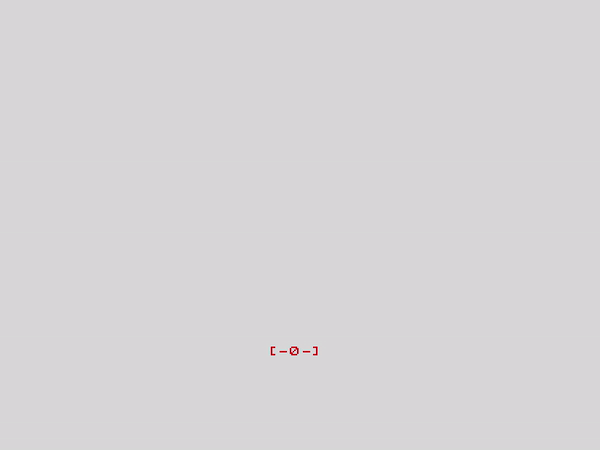

# ZX Naves

---

## Descripción

Este es un ejemplo de juego creado con BORIEL BASIC para el ZX Spectrum.
Uno de los ejemplos que hay en el [libro](https://www.amazon.es/Boriel-Basic-para-ZX-Spectrum/dp/B0CQD65FXZ/) de Duefectu, pinta una nave Tie y la mueve por pantalla.
He modificado un poco el código para que la nave consiga disparar y dejar solo el movimiento en horizontal, con la idea de que en la parte superior aparezcan enemigos a los que eliminar.
Esto es solo un ejemplo de lo que se puede conseguir con Boriel Basic siguiendo el libro y llevándo solamente 5 capítulos.

---

## Licencia

Este proyecto está bajo la Licencia MIT. Para más detalles, consulta el archivo [LICENSE](LICENSE).

---

## Agradecimientos

- [Duefectu](https://github.com/duefectu)
- [Boriel / ZX Basic](https://github.com/boriel/zxbasic)
- [Dr Gusman / ZX Basic Studio](https://github.com/gusmanb/ZXBasicStudio)
